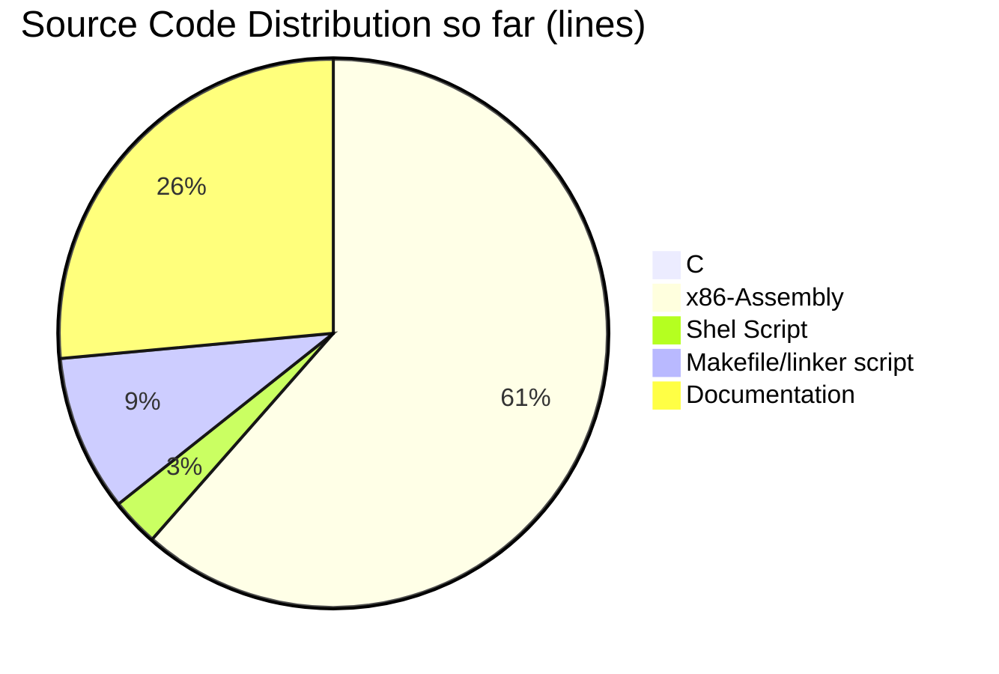

# KALIMERA - akfs

Kalimera - A(nother) Kernel From Scratch

Yes, this is another operating system kernel written from scratch. There are tons of the same out there.

So far, the planned features/architecture are: x86 (32 bits), protected-mode, ring 0 only, no paging, multitasking - kernel threads only, network communication (ethernet), IPv4, UDP, ICMP, BOOTP, ARP, RARP, serial communication, interrupts, exceptions, keyboard input.

It should be small and simple enough to enable anyone to grasp the workings of the entire kernel. Yep, you've just read it. It will be written in AT&T assembly language syntax and C.

Please, read the file [docs/journal.md](docs/journal.md).

Please, read the file [docs/journal.md](docs/journal.md).
But for the impatient, read next.

-----------------------------------------------------------------------------

In order to run the kalimera kernel you will need A REAL PC or a
virtual machine, like Qemu or VirtualBox. This is a work in progress,
so the Makefile supports only qemu for now. So, make sure you have qemu
installed in your system.

In order to run the kalimera kernel with a pretty cool animation:

      make clean; make run

Here are some milestones marked with tags:

      v0.05-kernel-device-driver-pic-keyboard
      v0.04-kernel-IDT-32-exceptions
      v0.03-kernel-in-32bit-protected-mode
      v0.02-bootloader-detect-memory
      v0.01-simple-bootloader

You can travel in time by just typing:

      git checkout <tag>

For instance, to checkout tag v0.03-kernel-in-32bit-protected-mode:

      git checkout v0.03-kernel-in-32bit-protected-mode

To return to the future:

      git checkout master

Enjoy!
