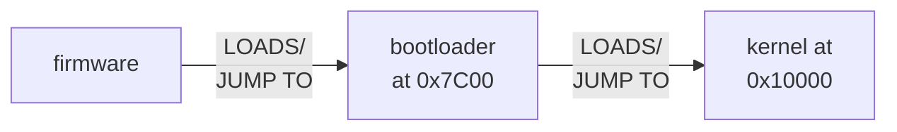
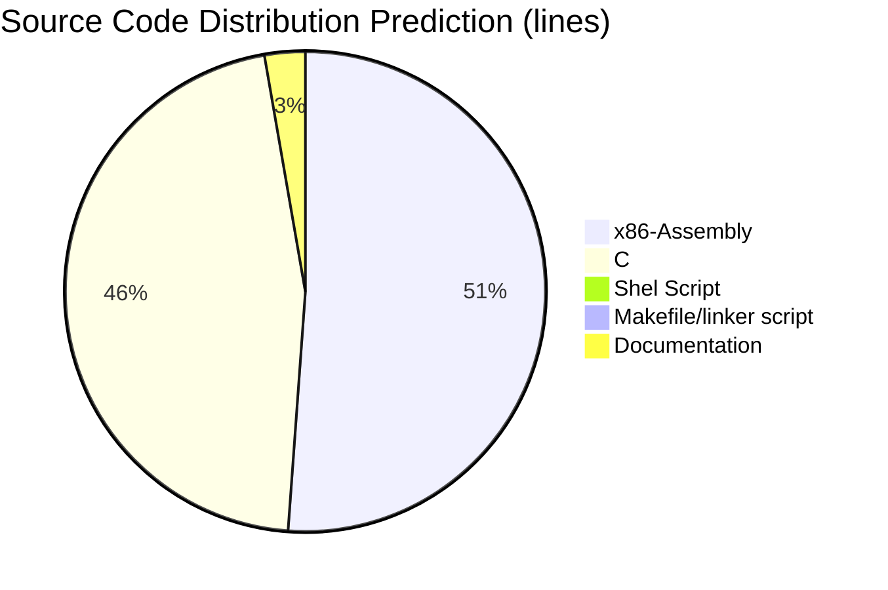

Author: rossano at gmail dot com

This document is a narrative of the process involved in creating this
kernel (kalimera). It discusses the sequence of events and the rationale
related to the choices we are going to make along the development.

=======================================================================

1 - Getting the system to execute our code as the first thing after
the firmware.

We have chosen the x86/i386 (a.k.a. PC) to be the target architecture
of the kernel. x86 systems start by executing the firmware located at the
main board (we are considering the execution of the BIOS and not
EFI/UEFI). As the last step, the firmware tries to load the first
sector of a bootable device. The most common size of a sector is 512
bytes. This first sector, when valid, must have the signature 0xAA55
at the end of the sector (byte 510 stores 0x55 and byte 511 stores
0xAA - remember that the counting starts at 0). This first sector is
called MBR and has the following format:

 - first 446 bytes: bootloader
 - space for four partition entries
 - last 2 bytes: 0xAA55 (boot signature)

The firmware does not care about the first 510 bytes. It is happy with
the boot signature, so we are free to write the first 510 bytes as we
wish. So, we are going to use all the available 510 bytes as our
bootloader (funny, it's so small and we used the phrase "all the
available 510 bytes" as if we had a huge space :)) ). The firmware
copies this sector to memory position 0x7C00 and checks if the values
0xAA and 0x55 are present at positions 0x7DFF and 0x7E00. If true, the
firmware instructs the CPU to jump to 0x7C00. Now we are in control of
the system, yey!!! We intend to put our kernel in an area that starts
at 0x10000 (64k). In short, the boot sequence is (This only renders on
GITLAB because it uses mermaid MD. So, if you are reading this from
GITHUB and want to see this graph, check this same project at GITLAB):

Ok, you know the theory. Now we must provide some code to be loaded by
the firmware. Considering we have a machine (real or virtual - qemu or
virtualbox) that has a hard disk, we must provide a code that fits in
512 bytes (actually 510).

   SEE FILE src/bootloader/bootloader.s

After programming and compiling this bootloader we need a way of
writing it to the "MBR". If the machine is virtual (qemu) it's
easy. Write the bootloader to the start of the virtual hard disk (it's
a file). If it's a real machine, you do have some more steps: I
accomplish this using a bootable dvd with a live linux distro. I boot
the real machine with the live linux, then I transfer the bootloader
using "wget" or "scp", and write it to the real hard disk using "dd"
(I wrote a script that accomplishes that! It works like a charm -- TO
BE UPLOADED).

The final layout of our disk is supposed to be as follows:

      1st sector   2nd sector   3rd sector   4th sector       Nth sector
    +------------+------------+------------+------------+   +------------+
    | Bootloader | kernel 1/N | kernel 2/N | kernel 3/N |...| kernel N/N |
    +------------+------------+------------+------------+   +------------+

Yep, no filesystem at all!!! Let's work with bare sectors. Once the
kernel is loaded into memory we don't need the disk anymore.

=======================================================================

2 - The boot loader (src/bootloader/bootloader.s)

We could use LILO, GRUB or any other bootloader to boot our kernel. So
why are we having the trouble to create our own? Well, why are we
having the trouble to create our very own kernel? We could use Linux or
any other kernel. We don't need kalimera - akfs (a(nother) kernel from
scratch). I hope you've got the point... We are creating the
bootloader 'cause we can :)) The objective is to create as much as we
can...

Our bootloader will execute 2 main tasks:

    - Load the kalimera kernel to memory
    - Detect the amount of RAM installed in the system and write it to
      a configuration area to be used by the kernel
    
The bootloader is going to copy our kernel from sectors 2, 3, 4, and
so on, to a memory space starting at position 0x10000 (64K). Yeah,
that's right. The disk is going to be used as a raw pool of
sectors. NO FILESYSTEM AT ALL! At least for now. When our bootloader
is put to run, BIOS services are still available to us. Let's use a
BIOS service to copy our kernel from disk to memory. We are going to
use EDD (Enhanced Disk Drive Services) and the BIOS DISK service. In
order to use the EDD service, we need to specify a Disk Address Packet
(DAP) structure. This structure is used to instruct BIOS "interrupt"
13h (invoked with the instruction "int $0x13") what to copy and where
to put it. Excerpt from our bootloader (showing our DAP):

    #.set KADDR, 0x800   # THIS IS USED TO KEEP BOTH bootloader
                         # AND fakekernel IN THE SAME SEGMENT
			  
    .set KADDR, 0x1000   # REAL KERNEL ADDRESS
    
    EDDPACKET:
            .byte  16, 0, 122, 0  # packet-size, always 0, sectors-max127, always 0
            .short 0x0000, KADDR  # BUFFER MEMORY ADDRESS	
                                  # - it will result in address 0x10000 (64k)
                                  # - Yeah, Intel 16 bit mode addressing nonsense
                                  #   (Kidding!! But explanation not important here,
                                  #    check x86 memory segmentation and addresses
                                  #    with 20 bits)
            .quad  0x00000001     # LBA Sector Number to start reading

Observe the variable KADDR. It holds the memory address to put the
kernel. The only purpose of KADDR is to make it easy to switch from
test routines to the real kernel. With the use of KADDR, It's easy to
copy a program to the position pointed by KADDR and jump to it
(explained later - testing the bootloader).

Returning to the main topic, this DAP tells the BIOS "interrupt" 13h,
service 0x42, to copy 122 sectors from disk. It also instructs the
service to start copying from sector 1 and to store the contents to
memory buffer at address 0x10000 (64k). Sector 0 hosts our bootloader
(it's the "MBR"), so skip it from the copy.

There are several ways to detect the amount of memory installed in a
system. The memory detection can be done by the kernel or by the
bootloader. By far, the method used the most is based on the service
0xE820 of the BIOS interrupt 0x15. GRUB uses it. Let's do the same.
Service 0xE820 fills in a buffer with a list of system memory regions.
Each entry of the list has the following structure:

       - BASE ADDRESS OF THE REGION (64 bits)
       - REGION AMOUNT OF MEMORY(64 bits)
       - TYPE OF THE REGION (32 bits)
       - ACPI 3.0 EXTENDED ATTRIBUTES (32 bits)

Our bootloader will get each lower part (least significant 32 bits) of
the "REGION AMOUNT OF MEMORY" and add them together to get the total
memory installed in the system (TOTAL RAM). We don't care, at least
for now, if the memory is available for use or not, we only need the
total RAM. This value will be stored at positon 0xf0f0 so the kernel
can access it latter to make use of this information.

Ok. So now you have written the bootloader and you want to test if
it's working as expected. To do so, I suggest writing a small program
that prints a message to the screen. Also, make this program read the
total RAM value obtained by the bootloader and print it to the screen
in decimal format. Let's go ahead and do it to test our
bootloader. Take a look at the file src/bootloader/fakekernel.s to see
what's going on.

   SEE FILE src/bootloader/fakekernel.s

Next, follow these steps to make the bootloader run fakekernel.s:

            A - cd src/bootloader
	    
	        Open FILE linker-script and change 0x10000 to 0x8000
                (we are informing the linker that our code starts at
                memory address 0x8000. This will translate all
                addresses used by the code accordingly - we are not
                using relocatable code, it's all FIXED!!!)
		   
                IMPORTANT: Observe that the correct value is
                           0x8000 (8 thousand)
		 
	     B - Open FILE bootloader.s and make sure you comment
	         the real values used by the REAL KERNEL, and uncomment
		 the values used by the fakekernel. You will end up with
		 something like this:
		 
                      .set KADDR, 0x800  
                      .set TOTAL_RAM, 0x7ee8
                      #.set KADDR, 0x1000 # REAL KERNEL ADDRESS      
                      #.set TOTAL_RAM, 0xf0f0

                 IMPORTANT: Observe that KADDR is 0x800 (8 hundred)
		 
             I created a Makefile with recipes to execute the next steps:
	     
             C - Assemble and link bootloader.s
             D - Assemble and link fakekernel.s
             E - create a qemu disk
             F - write the bootloader.bin to first sector
             G - write fakekernel.bin to second sector
             H - run qemu with all the parameters

             So, just go to the directory src/bootloader and type:

                make clean; make test

=======================================================================

3 - Kernel main file (src/kernel/kalimera.s)

+-- Timestamp: 2020-01-07-13:20 ---+

The idea is to create the bare bones functionality in one file, and
from that file call other functions present in other files. The source
code of this first file is written in x86 assembly language. I prefer
using the AT&T format. In this format, the structure of the mnemonic
is:

    opcode source destination

So, if you want to copy the value 0x10 to register EAX, you would
write the following code:

    mov $0x10, %eax

On the other hand, in Intel format you reverse source and destination
like this: "opcode destination source", and the same example would be
written like this: "mov eax, 10h". The assembler I use to assemble the
code is GAS (GNU Assembler).

Ok, so let's get started. Our kernel is supposed to run in 32 bits
protected mode. Things are a little bit easier in real-mode, as you
don't need some of the structures present in protected-mode. In
real-mode the position of the interrupt vector table (IVT) is fixed at
the very beginning of memory. On the other hand, in protected-mode the
IVT can be placed anywhere in memory. To inform where the IVT is you
should create a table called IDT (Interrupt Descriptor Table). In
protected-mode you can configure areas of the memory to be used as
code or data placeholders with rigid limits. In order to do that, you
create a table that informs how the memory should be used and where
that memory starts and ends. This table is called GDT (Global
Descriptor Table). Any process that is created can have it's own GDT
entry. In our case, we are going to create kernel threads to run our
tasks (always switched to ring 0) - kalimera kernel will not run
user-space code, i.e., CPU running in ring 3, at least for now. In
doing so, every thread shares the same GDT entries.

GDT is a complex beast where you can configure a bunch of things
related to the segment you are trying to use and protect. We're
getting back to the GDT structure latter. First, let's talk about how
to swith from real-mode to protected-mode.

In order to run the x86 CPU in protected-mode you should execute the
following steps:

     **** CODE IN 16 BITS WITH THE PROCESSOR IN REAL-MODE ****

     FIRST STEP: DISABLE INTERRUPTS. THIS IS IMPORTANT. IF YOU SWITCH
                 TO PROTECTED-MODE WITHOUT DEFINING AN IVT, YOU WILL
                 CRASH YOUR MACHINE. IF AN INTERRUPT IS RAISED AND YOU
                 DONT'T HAVE AN INTERRUPT HANDLER FOR THAT, BEHAVIOR IS
                 UNDEFINED. YOU COULD END UP EXECUTING WHATEVER GARBAGE
                 THE PROCESSOR WOULD EVENTUALLY POINT TO!!!! SO:
		 
                     cli
     NEXT:
         ..some other stuff that you can check in the code... The important
	 stuff:
	 
     A - Create a GDT with at least 3 entries:
         -- Dummy entry (recommended by Intel)
         -- CODE SEGMENT entry
         -- DATA SEGMENT entry
     B - Create a pointer to the GDT with the following structure:
         GDT SIZE, ADDRESS OF THE FIRST BYTE OF THE TABLE
     C - Create a pointer to the IDT with the following structure:
         IDT SIZE, ADDRESS OF THE FIRST BYTE OF THE TABLE
     D - Tell the CPU where those tables are in memory. To do that
         you use the instructions:

           addr32 lgdtl	gdt_ptr
           addr32 lidtl	idt_ptr

         Here, gdt_ptr and idt_ptr are the structures holding the information
	 described at B and C.
     E - Set the first bit in the CR0 register to 1. This informs the CPU it is
         in the process of switching to protected-mode. This bit is called PE.
     F - Execute a FAR JUMP instruction landing in 32 bit code. To do that
         you should execute the following CODE:

             .byte	0x66, 0xea      # FAR JUMP OPCODE
             .long	setDATA         # 1st OPCODE PARAM - JUMPS TO setData
             .word	0x8             # 2nd OPCODE PARAM - GDT ENTRY

         This code tells the CPU to JUMP to memory location
	 represented by the "variable" setDATA. But what the frak! Why
	 are we using opcodes instead of mnemonics? Sometimes it's not
	 possible to use a mnemonic to execute the instruction you
	 want to execute. The FAR JUMP from 16bit code to 32bit code
	 is one example where the assembler I'm using had problems to
	 generate the correct OPCODE. The mnemonic would be something
	 like this:

              ljmp target_address, gdt_entry

         A FAR JUMP is any jump that goes from one segment to another.

     **** CODE IN 32 BITS WITH THE PROCESSOR IN PROTECTED-MODE ****

     G - Code executing in 32 bits protected-mode. This first part of
         the code in 32bits executes the "function" setDATA. This
         "function" initializes all data segment registers with the
         GDT entry 0x10, which is an entry for a DATA SEGMENT. The
         code for that is like this:
	 
         .code32
         setDATA:

             /* DATA DESCRIPTOR */
             mov     $0x10, %eax   # INFORMS GDT ENTRY RESPONSIBLE FOR DATA SEGMENT
             mov     %eax, %ss
             mov     %eax, %ds
             mov     %eax, %es
             mov     %eax, %fs
             mov     %eax, %gs

     I - Test if PM bit in CR0 is set to 1. If so, I just print the message
         "KALIMERA KERNEL >> 32bits Protected Mode <<" to the screen.
     J - In order to have some fun. After the message, I put an ascii
         art of the USS Enterprise on the screen and animate it. Yey!!!

As you could see it's not as easy as we present it to students when
teaching Operating Systems. Well, you use any abstraction that suits
the audience.

Now let's cut to the chase. Let's code this.

   SEE FILE src/kernel/kalimera.s

I decided to make the GDT with the following entries:

	/* ENTRY 0x0 - RECOMMENDED BY INTEL (dummy) */
        movw    $0x0000, 0x800
        movw    $0x0000, 0x802
        movw    $0x0000, 0x804
        movw    $0x0000, 0x806

        
       /* ENTRY 0x8 - CODE SEGMENT */
        movw    $0xFFFF, 0x808
        movw    $0x0000, 0x80A
        movb    $0x00,   0x80C
        movb    $0x9A,   0x80D
        movb    $0xCF,   0x80E
        movb    $0x00,   0x80F

        /* ENTRY 0x10 -  DATA SEGMENT */
        movw    $0xFFFF, 0x810
        movw    $0x0000, 0x812
        movb    $0x00,   0x814
        movb    $0x92,   0x815
        movb    $0xCF,   0x816
        movb    $0x00,   0x817

Putting it in simple words, both the CODE SEGMENT and the DATA SEGMENT are 4GB
long, goes from 0x0 and 0xFFFFFFFF. Now let me break a GDT entry down. THIS IS
GOLD, SAVE IT SOMEWHERE.

Entry 0x8 (CODE SEGMENT) will be put in memory like this:

<pre>
                  Address                      Address
                    0x80F---+             +--- 0x808
                            |             |
                            v             v
      Higher addresses  - 0x00CF9A000000FFFF -  Lower Addresses
                       
Now let's break it down:

   * SEGMENT LIMIT
                               .        ....
      Higher addresses  - 0x00CF9A000000FFFF -  Lower Addresses
                               |        ||||
                               |        vvvv
			       +------>FFFFF This represents the limit of the
			                     segment. I prefer thinking
					     about it in terms o the number
			                     of "pages" of this segment.
					     This is a 20 bit number, all set
					     to "1".  2^20 equals 1M.
   * GRANULARITY
                              .
      Higher addresses  - 0x00CF9A000000FFFF -  Lower Addresses
                              |
                           +--+---+       
                           |      |
       Bit representation:   1100
	                     ||||
                             |||+-> RESERVED
                             ||+--> RESERVED			     
                             |+---> "1" This is a 32bit segment (0 is a 16bit)
                             +----> "1" Means "the page size" is 4k.
	                             This a multiplication factor. But I prefer
                                     thinking about it as the "page size"

            **************************************************************
            ****** So if you multiply 1M by 4K you end up with 4G. *******
            **************************************************************

   * BASE ADDRESS
                            ..    ......   
      Higher addresses  - 0x00CF9A000000FFFF -  Lower Addresses
                            ||    ||||||
                            |+---+||||||
                            +---+|||||||
                                ||||||||
                                vvvvvvvv
                                00000000 -> This represents the base address.

            **************************************************************
            ******  SO THIS SEGMENT STARTS AT MEMORY ADDRESS 0x0.  *******
            **************************************************************

   * SEGMENT TYPE (CODE / DATA)
                                ..   
      Higher addresses  - 0x00CF9A000000FFFF -  Lower Addresses
                                ||
                       +--------++-------+
                    +--+--+           +--+--+
                    |     |           |     |
                     1001              1010
		     ||||              |||+----> WE ARE NOT USING IT
                     ||||              ||+-----> "1" READABLE/WRITABLE
                     ||||              |+------> WE ARE NOT USING IT
                     ||||              +-------> "1" CODE SEGMENT
                     |||+----------------------> "1" CODE DESCRIPTOR
                     ||+------------------+
                     |+------------------+|
                     v                   ||
               SEGMENT IN MEMORY         vv 
                                         00 --> "0" RING NUMBER (kernel mode)

               Other values for ring number are 01, 10, 11 (user mode)

            **************************************************************
            ****** SO THIS SEGMENT IS USED TO PUT INSTRUCTIONS AND *******
            ****** NOT DATA, AND IS TO BE USED BY THE CPU IN RING 0*******
            **************************************************************
</pre>

Phew!!!! That was a bunch of bits!!! I hope you could have understood
the break down.

I will save you from the explanation of the DATA SEGMENT, it's almost
the same. Humm, not really. Let's dig in. They are really look alike
IN OUR KERNEL (it could be really different in another project). Take
a look:

<pre>
                .
   CODE  0x00CF9A000000FFFF (We've just broke down this one)
   DATA  0x00CF92000000FFFF
                |
                |       Bit representation of "2":
		|
                +--------> 0010
                           ||||
                           |||+-> WE ARE NOT USING IT			   
                           ||+--> "1" READABLE/WRITABLE
                           |+---> WE ARE NOT USING IT
                           +----> DATA SEGMENT
</pre>

It states that it goes from memory address 0x0 to 0xFFFFFFFF (4GB of
memory), it's a data segment, you can't execute code, it's readable
and writable. That's it. Phew again !!!!

+-- Timestamp: 2020-01-19-16:25 ---+

Now we have a program that runs in 32bits protected-mode without any
help of any OS. This program discarded all the BIOS IVT. It's on it's
own now. Now what? How are we going to transform this program in an OS
kernel. Next steps:

        - Create ALL IVT entries for hard/soft and exceptions
	- Create code for each IVT pointer (interrupt handler)
	- Create a multitasking environment:
	  -- Context switching logic
	  -- Scheduler
	- Device drivers for some hardware we want to use
	- ...
	
Yeah! This is going to be fun. 	

AND WE ARE NOT DONE YET. MORE ARE TO COME...BE PATIENT... BUT FOR NOW
YOU CAN READ THE APPENDICES.

=======================================================================

Appendix A. Exploring qemu memory

Qemu offers a very handy monitor where you can type a set of commands.
You activate this monitor passing the parameter "-monitor stdio" when
executing the command qemu. In special, the command "x /format address"
shows the memory (Virtual Memory) at position "address" and beyond. You
can do the same for Physical memory with "xp /format address". So, for
example, if you type:

     (qemu) x /16b 0x7C00

The monitor shows 16 1-byte chuncks of memory starting at position
0x7C00. You would end up we this output:

     0000000000007c00: 0x10 0x00 0x7a 0x00 0x00 0x00 0xf0 0x07
     0000000000007c08: 0x01 0x00 0x00 0x00 0x00 0x00 0x00 0x00

If you want to inspect memory showing 4-byte chunks of memory, you
would type this: (qemu) x /16w 0x7C00

     0000000000007c00: 0x007a0010 0x07f00000 0x00000001 0x00000000
     0000000000007c10: 0xd88ec88c 0x368dc08e 0x00b47c4b 0x10cd03b0
     0000000000007c20: 0x74c008ac 0xbb0eb409 0x10cd0007 0x368df2eb
     0000000000007c30: 0x80b27c00 0x13cd42b4 0x16cd00b4 0x03b000b4

The modifiers ("/fmt") are:

    SIZE
    
       b - 1-byte ( 8 bits) chuncks
       h - 2-byte (16 bits) chuncks
       w - 4-byte (32 bits) chuncks
       g - 8-byte (64 bits) chuncks

    FORMAT OR BASE

       x - hexadecimal
       d OR u - decimal
       c - \x format
       o - octal

=======================================================================

Appendix B. Exploring qemu REGISTERS !!!!

This is amazing. You should definitely explore this.
Type: (qemu) info registers

You end up with:

     EAX=00000000 EBX=0000dc80 ECX=0000b60a EDX=00000000
     ESI=0000fdd8 EDI=00000000 EBP=00000040 ESP=00006efc
     EIP=0000b626 EFL=00000246 [---Z-P-] CPL=0 II=0 A20=1 SMM=0 HLT=1
     ES =0040 00000400 0000ffff 00009300
     CS =f000 000f0000 0000ffff 00009b00
     SS =0000 00000000 0000ffff 00009300
     DS =0000 00000000 0000ffff 00009300
     FS =0000 00000000 0000ffff 00009300
     GS =0000 00000000 0000ffff 00009300
     LDT=0000 00000000 0000ffff 00008200
     TR =0000 00000000 0000ffff 00008b00
     GDT=     00000000 00000000
     IDT=     00000000 000003ff
     CR0=00000010 CR2=00000000 CR3=00000000 CR4=00000000
     DR0=0000000000000000 DR1=0000000000000000 DR2=0000000000000000 DR3=0000000000000000 
     DR6=00000000ffff0ff0 DR7=0000000000000400
     EFER=0000000000000000
     FCW=037f FSW=0000 [ST=0] FTW=00 MXCSR=00001f80
     FPR0=0000000000000000 0000 FPR1=0000000000000000 0000
     FPR2=0000000000000000 0000 FPR3=0000000000000000 0000
     FPR4=0000000000000000 0000 FPR5=0000000000000000 0000
     FPR6=0000000000000000 0000 FPR7=0000000000000000 0000
     XMM00=00000000000000000000000000000000 XMM01=00000000000000000000000000000000
     XMM02=00000000000000000000000000000000 XMM03=00000000000000000000000000000000
     XMM04=00000000000000000000000000000000 XMM05=00000000000000000000000000000000
     XMM06=00000000000000000000000000000000 XMM07=00000000000000000000000000000000

This is very handy. For instance, this output shows CR0 with value 00000010.
The right-most bit (PE) is set to 0. This shows the CPU is running in REAL-MODE.
You can also see that GDT shows the value 00000000 00000000 (that's normal when
in REAL-MODE (GDT is non-existent in REAL-MODE). IDT shows the IVT starts at
position 0 e ends at position 000003ff.

The following output shows a CPU running in PROTECTED-MODE:

     EAX=000b8c1d EBX=000b8c1e ECX=00004107 EDX=0000000c
     ESI=00010218 EDI=000b8c81 EBP=017fffcc ESP=017fffc8
     EIP=00011d17 EFL=00000202 [-------] CPL=0 II=0 A20=1 SMM=0 HLT=0
     ES =0010 00000000 ffffffff 00cf9300 DPL=0 DS   [-WA]
     CS =0008 00000000 ffffffff 00cf9a00 DPL=0 CS32 [-R-]
     SS =0010 00000000 ffffffff 00cf9300 DPL=0 DS   [-WA]
     DS =0010 00000000 ffffffff 00cf9300 DPL=0 DS   [-WA]
     FS =0010 00000000 ffffffff 00cf9300 DPL=0 DS   [-WA]
     GS =0010 00000000 ffffffff 00cf9300 DPL=0 DS   [-WA]
     LDT=0000 00000000 0000ffff 00008200 DPL=0 LDT
     TR =0000 00000000 0000ffff 00008b00 DPL=0 TSS32-busy
     GDT=     00000800 00000017
     IDT=     00000000 00000800
     CR0=00000011 CR2=00000000 CR3=00000000 CR4=00000000
     DR0=0000000000000000 DR1=0000000000000000 DR2=0000000000000000 DR3=0000000000000000 
     DR6=00000000ffff0ff0 DR7=0000000000000400
     EFER=0000000000000000
     FCW=037f FSW=0000 [ST=0] FTW=00 MXCSR=00001f80
     FPR0=0000000000000000 0000 FPR1=0000000000000000 0000
     FPR2=0000000000000000 0000 FPR3=0000000000000000 0000
     FPR4=0000000000000000 0000 FPR5=0000000000000000 0000
     FPR6=0000000000000000 0000 FPR7=0000000000000000 0000
     XMM00=00000000000000000000000000000000 XMM01=00000000000000000000000000000000
     XMM02=00000000000000000000000000000000 XMM03=00000000000000000000000000000000
     XMM04=00000000000000000000000000000000 XMM05=00000000000000000000000000000000
     XMM06=00000000000000000000000000000000 XMM07=00000000000000000000000000000000

Observe CR0 value is 00000011. The right-most bit (PE) is set to 1.
You can also see that GDT shows the value 00000800 00000017. This means
the GDT goes from memory position 0x800 to 0x817. 

IDT shows the IVT starts at position 0 and ends at position 00000800.

So cool! I can't express my joy enough in being able to see this.

=======================================================================

Appendix C. Bootloader in memory

This is the memory occupied by our bootloader. This was obtained typing
this at the (qemu) prompt: (qemu) x /256h 0x7c00

     0000000000007c00: 0x0010 0x007a 0x0000 0x07f0 0x0001 0x0000 0x0000 0x0000
     0000000000007c10: 0xc88c 0xd88e 0xc08e 0x368d 0x7c4b 0x00b4 0x03b0 0x10cd
     0000000000007c20: 0x08ac 0x74c0 0xb409 0xbb0e 0x0007 0x10cd 0xf2eb 0x368d
     0000000000007c30: 0x7c00 0x80b2 0x42b4 0x13cd 0x00b4 0x16cd 0x00b4 0x03b0
     0000000000007c40: 0x10cd 0x00ea 0xf000 0xfa07 0xebf4 0x3efc 0x414b 0x494c
     0000000000007c50: 0x454d 0x4152 0x4220 0x4f4f 0x2054 0x4f4c 0x4441 0x5245
     0000000000007c60: 0x2d20 0x2d2d 0x5020 0x6572 0x7373 0x6520 0x746e 0x7265
     0000000000007c70: 0x7420 0x206f 0x7572 0x206e 0x656b 0x6e72 0x6c65 0x0d0a
     0000000000007c80: 0x0000 0x0000 0x0000 0x0000 0x0000 0x0000 0x0000 0x0000
     0000000000007c90: 0x0000 0x0000 0x0000 0x0000 0x0000 0x0000 0x0000 0x0000
     0000000000007ca0: 0x0000 0x0000 0x0000 0x0000 0x0000 0x0000 0x0000 0x0000
     0000000000007cb0: 0x0000 0x0000 0x0000 0x0000 0x0000 0x0000 0x0000 0x0000
     0000000000007cc0: 0x0000 0x0000 0x0000 0x0000 0x0000 0x0000 0x0000 0x0000
     0000000000007cd0: 0x0000 0x0000 0x0000 0x0000 0x0000 0x0000 0x0000 0x0000
     0000000000007ce0: 0x0000 0x0000 0x0000 0x0000 0x0000 0x0000 0x0000 0x0000
     0000000000007cf0: 0x0000 0x0000 0x0000 0x0000 0x0000 0x0000 0x0000 0x0000
     0000000000007d00: 0x0000 0x0000 0x0000 0x0000 0x0000 0x0000 0x0000 0x0000
     0000000000007d10: 0x0000 0x0000 0x0000 0x0000 0x0000 0x0000 0x0000 0x0000
     0000000000007d20: 0x0000 0x0000 0x0000 0x0000 0x0000 0x0000 0x0000 0x0000
     0000000000007d30: 0x0000 0x0000 0x0000 0x0000 0x0000 0x0000 0x0000 0x0000
     0000000000007d40: 0x0000 0x0000 0x0000 0x0000 0x0000 0x0000 0x0000 0x0000
     0000000000007d50: 0x0000 0x0000 0x0000 0x0000 0x0000 0x0000 0x0000 0x0000
     0000000000007d60: 0x0000 0x0000 0x0000 0x0000 0x0000 0x0000 0x0000 0x0000
     0000000000007d70: 0x0000 0x0000 0x0000 0x0000 0x0000 0x0000 0x0000 0x0000
     0000000000007d80: 0x0000 0x0000 0x0000 0x0000 0x0000 0x0000 0x0000 0x0000
     0000000000007d90: 0x0000 0x0000 0x0000 0x0000 0x0000 0x0000 0x0000 0x0000
     0000000000007da0: 0x0000 0x0000 0x0000 0x0000 0x0000 0x0000 0x0000 0x0000
     0000000000007db0: 0x0000 0x0000 0x0000 0x0000 0x0000 0x0000 0x0000 0x0000
     0000000000007dc0: 0x0000 0x0000 0x0000 0x0000 0x0000 0x0000 0x0000 0x0000
     0000000000007dd0: 0x0000 0x0000 0x0000 0x0000 0x0000 0x0000 0x0000 0x0000
     0000000000007de0: 0x0000 0x0000 0x0000 0x0000 0x0000 0x0000 0x0000 0x0000
     0000000000007df0: 0x0000 0x0000 0x0000 0x0000 0x0000 0x0000 0x0000 0xaa55

Observe the value 0xaa55 at the end.

=======================================================================

Appendix D. fakekernel in memory (now the address is 0x8000, instead of 0x7F00)

This is the memory occupied by our fakekernel. This was obtained typing
this at the (qemu) prompt: (qemu) x /48h 0x7F00

     0000000000007f00: 0x368d 0x7f18 0x08ac 0x74c0 0xb409 0xbb0e 0x0007 0x10cd
     0000000000007f10: 0xf2eb 0x00b4 0x16cd 0xfeeb 0x3e20 0x463e 0x4b41 0x2045
     0000000000007f20: 0x454b 0x4e52 0x4c45 0x4c20 0x414f 0x4544 0x2044 0x2d2d
     0000000000007f30: 0x202d 0x5449 0x5320 0x4545 0x534d 0x5420 0x4548 0x4220
     0000000000007f40: 0x4f4f 0x4c54 0x414f 0x4544 0x2052 0x4f57 0x4b52 0x4445
     0000000000007f50: 0x202e 0x6159 0x2179 0x0a21 0x000d 0x0000 0x0000 0x0000
     0000000000007f60: 0x0000 0x0000 0x0000 0x0000 0x0000 0x0000 0x0000 0x0000
     0000000000007f70: 0x0000 0x0000 0x0000 0x0000 0x0000 0x0000 0x0000 0x0000 

=======================================================================

Appendix E. Both bootloader and fakekernel in memory

This is the memory occupied by our fakekernel. This was obtained typing
this at the (qemu) prompt: (qemu) x /432h 0x7C00

     0000000000007c00: 0x0010 0x007a 0x0000 0x07f0 0x0001 0x0000 0x0000 0x0000
     0000000000007c10: 0xc88c 0xd88e 0xc08e 0x368d 0x7c4b 0x00b4 0x03b0 0x10cd
     0000000000007c20: 0x08ac 0x74c0 0xb409 0xbb0e 0x0007 0x10cd 0xf2eb 0x368d
     0000000000007c30: 0x7c00 0x80b2 0x42b4 0x13cd 0x00b4 0x16cd 0x00b4 0x03b0
     0000000000007c40: 0x10cd 0x00ea 0xf000 0xfa07 0xebf4 0x3efc 0x414b 0x494c
     0000000000007c50: 0x454d 0x4152 0x4220 0x4f4f 0x2054 0x4f4c 0x4441 0x5245
     0000000000007c60: 0x2d20 0x2d2d 0x5020 0x6572 0x7373 0x6520 0x746e 0x7265
     0000000000007c70: 0x7420 0x206f 0x7572 0x206e 0x656b 0x6e72 0x6c65 0x0d0a
     0000000000007c80: 0x0000 0x0000 0x0000 0x0000 0x0000 0x0000 0x0000 0x0000
     0000000000007c90: 0x0000 0x0000 0x0000 0x0000 0x0000 0x0000 0x0000 0x0000
     0000000000007ca0: 0x0000 0x0000 0x0000 0x0000 0x0000 0x0000 0x0000 0x0000
     0000000000007cb0: 0x0000 0x0000 0x0000 0x0000 0x0000 0x0000 0x0000 0x0000
     0000000000007cc0: 0x0000 0x0000 0x0000 0x0000 0x0000 0x0000 0x0000 0x0000
     0000000000007cd0: 0x0000 0x0000 0x0000 0x0000 0x0000 0x0000 0x0000 0x0000
     0000000000007ce0: 0x0000 0x0000 0x0000 0x0000 0x0000 0x0000 0x0000 0x0000
     0000000000007cf0: 0x0000 0x0000 0x0000 0x0000 0x0000 0x0000 0x0000 0x0000
     0000000000007d00: 0x0000 0x0000 0x0000 0x0000 0x0000 0x0000 0x0000 0x0000
     0000000000007d10: 0x0000 0x0000 0x0000 0x0000 0x0000 0x0000 0x0000 0x0000
     0000000000007d20: 0x0000 0x0000 0x0000 0x0000 0x0000 0x0000 0x0000 0x0000
     0000000000007d30: 0x0000 0x0000 0x0000 0x0000 0x0000 0x0000 0x0000 0x0000
     0000000000007d40: 0x0000 0x0000 0x0000 0x0000 0x0000 0x0000 0x0000 0x0000
     0000000000007d50: 0x0000 0x0000 0x0000 0x0000 0x0000 0x0000 0x0000 0x0000
     0000000000007d60: 0x0000 0x0000 0x0000 0x0000 0x0000 0x0000 0x0000 0x0000
     0000000000007d70: 0x0000 0x0000 0x0000 0x0000 0x0000 0x0000 0x0000 0x0000
     0000000000007d80: 0x0000 0x0000 0x0000 0x0000 0x0000 0x0000 0x0000 0x0000
     0000000000007d90: 0x0000 0x0000 0x0000 0x0000 0x0000 0x0000 0x0000 0x0000
     0000000000007da0: 0x0000 0x0000 0x0000 0x0000 0x0000 0x0000 0x0000 0x0000
     0000000000007db0: 0x0000 0x0000 0x0000 0x0000 0x0000 0x0000 0x0000 0x0000
     0000000000007dc0: 0x0000 0x0000 0x0000 0x0000 0x0000 0x0000 0x0000 0x0000
     0000000000007dd0: 0x0000 0x0000 0x0000 0x0000 0x0000 0x0000 0x0000 0x0000
     0000000000007de0: 0x0000 0x0000 0x0000 0x0000 0x0000 0x0000 0x0000 0x0000
     0000000000007df0: 0x0000 0x0000 0x0000 0x0000 0x0000 0x0000 0x0000 0xaa55
     0000000000007e00: 0x0000 0x0000 0x0000 0x0000 0x0000 0x0000 0x0000 0x0000
     0000000000007e10: 0x0000 0x0000 0x0000 0x0000 0x0000 0x0000 0x0000 0x0000
     0000000000007e20: 0x0000 0x0000 0x0000 0x0000 0x0000 0x0000 0x0000 0x0000
     0000000000007e30: 0x0000 0x0000 0x0000 0x0000 0x0000 0x0000 0x0000 0x0000
     0000000000007e40: 0x0000 0x0000 0x0000 0x0000 0x0000 0x0000 0x0000 0x0000
     0000000000007e50: 0x0000 0x0000 0x0000 0x0000 0x0000 0x0000 0x0000 0x0000
     0000000000007e60: 0x0000 0x0000 0x0000 0x0000 0x0000 0x0000 0x0000 0x0000
     0000000000007e70: 0x0000 0x0000 0x0000 0x0000 0x0000 0x0000 0x0000 0x0000
     0000000000007e80: 0x0000 0x0000 0x0000 0x0000 0x0000 0x0000 0x0000 0x0000
     0000000000007e90: 0x0000 0x0000 0x0000 0x0000 0x0000 0x0000 0x0000 0x0000
     0000000000007ea0: 0x0000 0x0000 0x0000 0x0000 0x0000 0x0000 0x0000 0x0000
     0000000000007eb0: 0x0000 0x0000 0x0000 0x0000 0x0000 0x0000 0x0000 0x0000
     0000000000007ec0: 0x0000 0x0000 0x0000 0x0000 0x0000 0x0000 0x0000 0x0000
     0000000000007ed0: 0x0000 0x0000 0x0000 0x0000 0x0000 0x0000 0x0000 0x0000
     0000000000007ee0: 0x0000 0x0000 0x0000 0x0000 0x0000 0x0000 0x0000 0x0000
     0000000000007ef0: 0x0000 0x0000 0x0000 0x0000 0x0000 0x0000 0x0000 0x0000
     0000000000007f00: 0x368d 0x7f18 0x08ac 0x74c0 0xb409 0xbb0e 0x0007 0x10cd
     0000000000007f10: 0xf2eb 0x00b4 0x16cd 0xfeeb 0x3e20 0x463e 0x4b41 0x2045
     0000000000007f20: 0x454b 0x4e52 0x4c45 0x4c20 0x414f 0x4544 0x2044 0x2d2d
     0000000000007f30: 0x202d 0x5449 0x5320 0x4545 0x534d 0x5420 0x4548 0x4220
     0000000000007f40: 0x4f4f 0x4c54 0x414f 0x4544 0x2052 0x4f57 0x4b52 0x4445
     0000000000007f50: 0x202e 0x6159 0x2179 0x0a21 0x000d 0x0000 0x0000 0x0000

=======================================================================

Appendix F. Source Code - Number of lines prediction based on another
            kernel I developed

